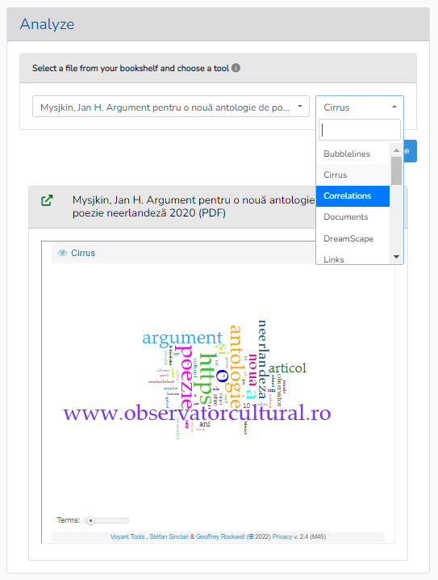

# YARM_Analyze

## Usage (follow/run the following commands in your terminal)

to install package

> composer require yarm/analyze

publish routes, config, views en JS

> php artisan vendor:publish --provider="Yarm\Analyze\AnalyzeServiceProvider" --force

 
# Note
* Yarm/bookshelf needs to be installed and configured
* Don't forget to restart npm after installation

# view

